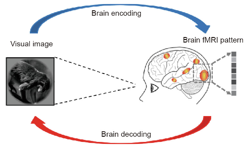

<h1 align="center">
    Img2brain
</h1>

<p align="center">
    <a href="https://github.com/sayalaruano/NTDs2RDF/blob/main/LICENSE.md">
        
    </a>
        <a href="https://doi.org/10.5281/zenodo.7979730">
        
    </a>
    <a href="https://colab.research.google.com/github/sayalaruano/img2brain/blob/main/EDA_feateng_modelbuild_img2brain.ipynb">
        
    </a>
</p>

<p align="center">
   Predicting the neural responses to visual stimuli of naturalistic scenes using machine learning
</p>

## **Table of contents:**
- [About the project](#about-the-project)
- [Dataset](#dataset)
- [Feature engineering](#feature-engineering)
- [Machine learning models](#machine-learning-models)
- [How to set up the environmen to run the code?](#how-to-set-up-the-environmen-to-run-the-code)
- [Structure of the repository](#structure-of-the-repository)
- [Credits](#credits)
- [Further details](#details)
- [Contact](#contact)

## **About the project**

The goal of this project is to employ machine learning techniques to forecast the neural visual responses triggered by naturalistic scenes. These computational models strive to replicate the intricate process through which neuronal activity encodes to visual stimuli aroused by the external environment. The following figure gives an schematic representation of the brain encoding and decoding processes.

<p align="center">
<figure>
  
  <figcaption> Brain encoding and decoding in fMR. Obtained from <a href="https://doi.org/10.1016/j.eng.2019.03.010">[1]</a>. </figcaption>
</figure>
</p>

Visual encoding models based on fMRI data employ algorithms that transform image pixels into model features and map these features to brain activity. This framework enables the prediction of neural responses from images. The following figure illustrates the mapping between the pixel, feature, and brain spaces.

<p align="center">
<figure align="center">
  
  <figcaption>The general architecture of visual encoding models that consists of three spaces (the input space, the feature space, and the brain activity space) and two in-between mappings. Obtained from <a href="https://doi.org/10.1016/j.neuroimage.2010.07.073">[2]</a>. </figcaption>
</figure>
</p>

## **Dataset**

The data for this project is part of the [Natural Scenes Dataset][nsd] (NSD), a massive dataset of 7T fMRI responses to images of natural scenes coming from the [COCO dataset][coco]. The training dataset consists of brain responses measured at 10.000 brain locations (voxels) to 8857 images (in jpg format) for one subject. The The 10.000 voxels are distributed around the visual pathway and may encode perceptual and semantic features in different proportions. The test dataset comprises 984 images (in jpg format), and the goal is to predict the brain responses to these images.

You can access the dataset through Zenodo with the following DOI: [10.5281/zenodo.7979730][dataset_doi].

The training dataset was split into training and validation partitions with an 80/20 ratio. The training partition was used to train the models, and the validation partition was used to evaluate the models. The test dataset was used to make predictions with the best model on unseen data.

## **Feature engineering**

Due to the high dimensionality of the feature representation of images using the raw pixel values (i.e., the original images have a size of 425x425 and 3 channels (RGB), which results in a feature representation of 425x425x3 = 541875 features), I used the representations obtained from different layers of pretrained CNNs to obtain a lower dimensional representation of the images. In this case, I tried various layers of four different pretrained CNNs: [AlexNet][alexnet], [VGG16][vgg16], [ResNet50][resnet50], and [InceptionV3][inceptionv3], available in the [torchvision package][torchvision].

The feature representations of the images was obtained by passing the images through the pretrained CNNs and extracting the output of the desired layer. The size of the feature vectors at this point was still very large, so I used PCA to overcome this problem and got a set of 30 features. I fit the PCA on the training images features, and used it to downsample the training, validation and test images features. 

I evaluated the best feature representation by training a simple linear regression model to predict the brain activity of the voxels from the feature representation of the images. The best feature representation was the one that resulted in the highest encoding accuracy (i.e., median correlation between the predicted and actual brain activity of the voxels) on the validation set.

You can find the code for this part of the project [here][notebook_feateng].

## **Machine learning models**

I trained 6 different machine learnning algorithms (linear regression - base model, ridge regression, lasso regression, elasticnet regression, k-nearest neighbours regressor, and decision tree regressor) to predict the brain activity of the voxels from the feature representation of the images. In this project, the learning task was a **multioutput regression problem**, where the input is the feature representation of the images and the output is the brain activity of all the voxels. Each regressor maps from the feature space to each voxel, so there is a separate encoding model per voxel, leading to **voxelwise encoding models**. Therefore, every model trained with this dataset have 10.000 independently regression models with n coeficients each (the number of features). As in the previous section, the best model was the one that resulted in the highest encoding accuracy on the validation set.

The best model was the `lasso regression` with an encoding accuracy of ` 0.2417` on the validation set. The best hyperparameters of the lasso regression model were `alpha=0.01` and the default `max_iter=1000`. This model was trained with the feature representation of the images obtained from the layer `features.12` of the AlexNet CNN. The feature representation of the images was reduced to 100 features using PCA. Although the encoding accuracy of the best model was low, it is a starting point to buld up on.

Check it out the code for this part of the project [here][notebook_ml].

## **How to set up the environmen to run the code?**

I used [conda][conda] to create a virtual environment with the required libraries to run the code. To create a Python virtual environment with libraries and dependencies required for this project, you should clone this GitHub repository, open a terminal, move to the folder containing this repository, and create a conda virtual environment with the following commands:

```bash
# Create the conda virtual environment
$ conda env create -f img2brain_env.yml

# Activate the conda virtual environment
$ conda activate img2brain_env
```
Then, you can open the Jupyter notebook with the IDE of your choice and run the code.

## **Structure of the repository**
The main files and directories of this repository are:

|File|Description|
|:-:|---|
|[EDA_feateng_modelbuild_img2brain.ipynb](EDA_feateng_modelbuild_img2brain.ipynb)|Jupyter notebook with EDA, feature engineering, creation of the machine learning algorithms, performance metrics of all models, and evaluation of the best model|
|[LassoRegressor_alpha0.01_img2brain.bin](LassoRegressor_alpha0.01_img2brain.bin)|Bin file of the best model|
|[img2brain_env.yml](img2brain_env.yml)|File with libraries and dependencies to create the conda virtual environment|
|[img2brain_report.pdf](img2brain_report.pdf)|Report with detailed explanation of the project|
|[Results/](Results/)|Folder to save performance metrics and other outputs of the machine learning models|
|[Scripts_plots/](Scripts_plots/)|Folder for the scripts to create the plots of the report|
|[img/](img/)|images and gifs|

## **Credits**
- Developed by [Sebastián Ayala Ruano](https://sayalaruano.github.io/). I created this project for my capstone project of the Machine learning course from the [MSc in Systems Biology][sysbio] at [Maastricht University][maasuni].

- Part of the code was inspired by the [Algonauts Project 2023 Challenge][alg_web] development kit tutorial.

## **Further details**
More details about the biological background of the project, the interpretation of the results, and ideas for frther work are available in this [pdf report](img2brain_report.pdf).

## **Contact**
[](https://twitter.com/sayalaruano)

If you have comments or suggestions about this project, you can [open an issue](https://github.com/sayalaruano/img2brain/issues/new) in this repository, or email me at sebasar1245@gamil.com.

[nsd]: https://doi.org/10.1038/s41593-021-00962-x
[coco]: https://cocodataset.org/#home
[alg_web]: http://algonauts.csail.mit.edu
[sysbio]: https://www.maastrichtuniversity.nl/education/master/systems-biology
[maasuni]: https://www.maastrichtuniversity.nl/
[dataset_doi]: https://doi.org/10.5281/zenodo.7979730
[alexnet]: https://pytorch.org/vision/master/models/alexnet.html
[vgg16]: https://pytorch.org/vision/master/models/generated/torchvision.models.vgg16.html#torchvision.models.vgg16
[resnet50]: https://pytorch.org/vision/master/models/generated/torchvision.models.resnet50.html#torchvision.models.resnet50
[inceptionv3]: https://pytorch.org/vision/master/models/inception.html
[torchvision]: https://pytorch.org/vision/stable/index.html
[notebook_feateng]: ./EDA_feateng_modelbuild_img2brain.ipynb#3-feature-engineering
[notebook_ml]: ./EDA_feateng_modelbuild_img2brain.ipynb#4-bulding-and-evaluating-machine-learning-models
[conda]: https://docs.conda.io/en/latest/